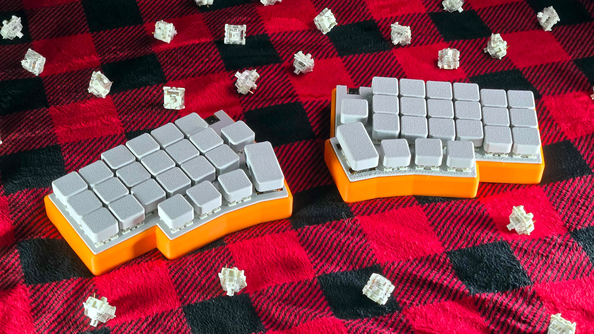
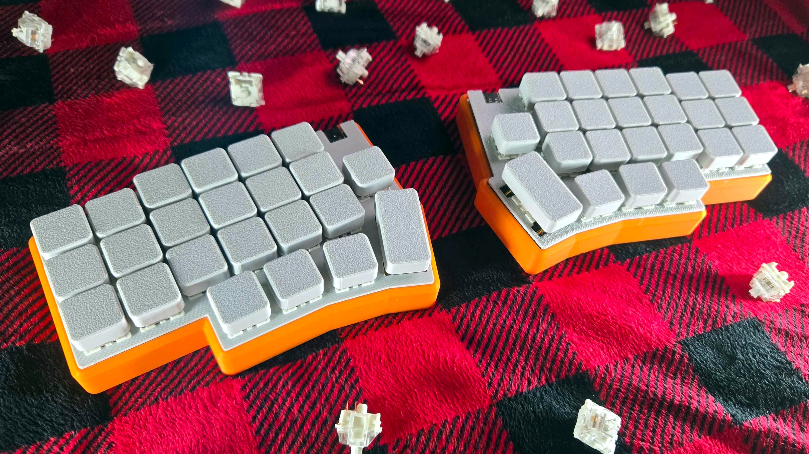
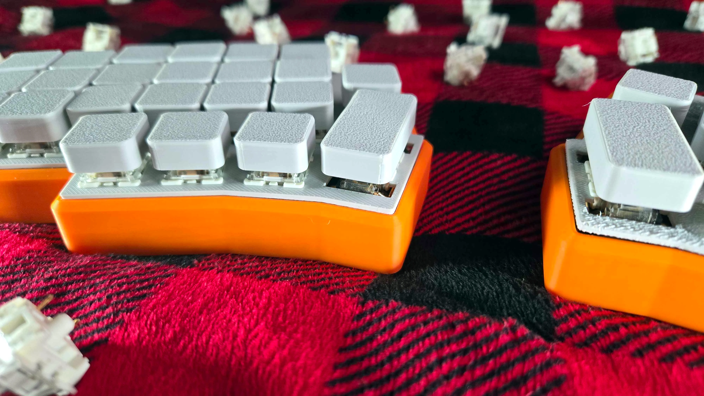
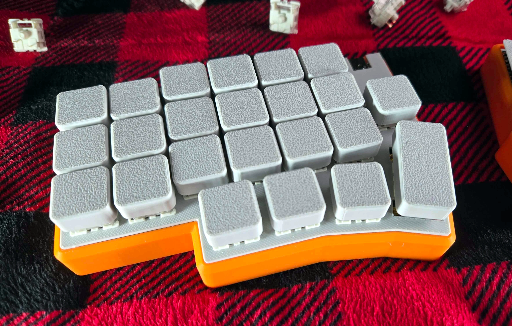

<h1 align="center">sf46</h1>

    

### About

The **sf46** is an ergonomic 46-key split mechanical keyboard based on the ESP32 family of chips by Espressif

### Features

- USB Type-C Port
- Fully open-source/open-hardware design and firmware files
- Bluetooth/BLE wireless connectivity
- 3300mAh rechargeable battery (for each side)

### Assembly/Mechanical Information

**Required parts:**

- PCB ([Download Gerber](/pcb/Gerber_sf46.zip))
  - Repo includes [design files](/pcb/EasyEDA_sf46.json) for importing into EasyEDA
- 3D-printed case ([Download .STEP](/cad/case_v5.step))
- Keyswitch plate ([Download .STEP](/cad/plate_v3.step))
- **46x** Full-size MX-style keyswitches
- **46x** MX-style Hot Swap Switch Mounts
- **46x** switch diodes ([C14996](https://www.lcsc.com/product-detail/Schottky-Diodes_MDD-Microdiode-Semiconductor-SS210_C14996.html))
- **2x** 2U Screw-in PCB Mount Stabilizers
- **2x** ESP32 Supermini
- **2x** Lithium battery charger/boost converter
- **2x** 60x50x6mm (or similar) rechargeable battery

**Optional, but recommended parts:**

- Krytox 205 Grade 0 lubricant
- Switch disassembly tool
- Case filler/sound dampening (I used polyester fiber and foam pads)

### Firmware

The firmware is [available for download](https://github.com/strayfade/sf46/tree/main/firmware) and can be compiled/uploaded to the ESP32s using [PlatformIO](https://platformio.org/).

### License + Credits

The **sf46** keyboard design and CAD files are released under the **GPLv3** license.

This project uses code from the [ESP32-BLE-Keyboard](https://github.com/T-vK/ESP32-BLE-Keyboard) repository.

### Gallery

